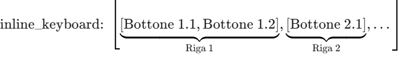
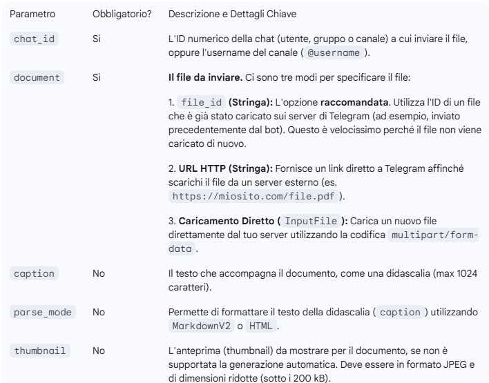

# Appunti su Telegram API

### InlineKeyboardMarkup

Si crea un array di array di oggetti InlineKeyboardButton, in base alla posizione, vedi immagine sotto.



### sendDocument



#### Le Tre Modalità di Invio (`document`)

Il modo in cui gestisci il campo `document` determina la complessità della richiesta.

##### 1\. Invio tramite `file_id` (Riutilizzo)

Se hai già inviato un file o conosci il suo `file_id`, questa è l'opzione migliore per riutilizzare lo stesso documento in più chat. Non è necessario inviare il file binario, solo la stringa ID.

  * **Corpo Richiesta (JSON):**

    ```json
    {
        "chat_id": "@nomecanale",
        "document": "BQACAgQAAxkBAAIC..." // L'ID del file ottenuto da un invio precedente
    }
    ```

##### 2\. Invio tramite URL HTTP (Download Esterno)

Fornisci a Telegram un link pubblico da cui scaricare il documento.

  * **Corpo Richiesta (JSON):**

    ```json
    {
        "chat_id": 123456789,
        "document": "https://miosito.com/documenti/rapporto_2025.pdf",
        "caption": "Ecco il nostro rapporto annuale."
    }
    ```

##### 3\. Caricamento Diretto (`multipart/form-data`)

Questo è il metodo necessario quando devi inviare un **nuovo file** che si trova sul tuo server.

  * **Modalità Richiesta:** La richiesta **NON** è una semplice richiesta JSON, ma una richiesta **`multipart/form-data`**.
  * **Struttura:** Il corpo della richiesta deve contenere due parti:
    1.  I campi di testo standard (come `chat_id`, `caption`, `parse_mode`).
    2.  Il file binario del documento, etichettato con il nome del campo, che in questo caso è `document`.

In JavaScript (in un ambiente Node.js o browser con librerie specifiche o con l'oggetto `FormData`), dovrai costruire un oggetto `FormData` per gestire questo tipo di invio:

```javascript
// Esempio 

const formData = new FormData();
formData.append('chat_id', CHAT_ID);
// 'fileInput' è un riferimento all'input file o al buffer binario del file
formData.append('document', fileInput); 
formData.append('caption', 'Documento caricato ora.');

// La fetch dovrà specificare l'oggetto FormData come body.
fetch(`${url_api_tg}/sendDocument`, {
    method: 'POST',
    body: formData // Importante: non impostare Content-Type, FormData lo imposta automaticamente.
})
// ...
```

#### Esempio richiesta con body multipart/form-data
Questa struttura non è un JSON, ma il formato esatto del corpo della richiesta HTTP. Il tuo browser lo genera automaticamente usando l'oggetto `FormData`.

##### 1\. Header HTTP

L'header è cruciale e definisce il *Boundary* (il separatore casuale) che verrà usato nel corpo.

```http
POST /bot<IL_TUO_TOKEN>/sendDocument HTTP/1.1
Host: api.telegram.org
Content-Type: multipart/form-data; boundary=------------------------abcdef1234567890
```

##### 2\. Corpo della Richiesta

Il corpo è diviso dal **Boundary** (nell'esempio, `------------------------abcdef1234567890`).

```
--------------------------abcdef1234567890
Content-Disposition: form-data; name="chat_id"

@Fenix_moneoo
--------------------------abcdef1234567890
Content-Disposition: form-data; name="caption"

Il mio documento importante inviato tramite bot.
--------------------------abcdef1234567890
Content-Disposition: form-data; name="document"; filename="relazione_finale.pdf"
Content-Type: application/pdf

%PDF-1.4... (dati binari del file)
--------------------------abcdef1234567890--
```

-----

### Ricezione Agg. `getUpdates()`

Il metodo `getUpdates()` è il meccanismo di **Polling** utilizzato dal bot per ricevere nuovi messaggi e interazioni.

#### 1\. Struttura della Richiesta

La richiesta utilizza il metodo `GET` o `POST` e include i parametri per gestire il flusso degli aggiornamenti.

```http
GET https://api.telegram.org/bot<IL_TUO_TOKEN>/getUpdates
```

| Parametro | Tipo | Descrizione |
| :--- | :--- | :--- |
| **`offset`** | Intero | **Fondamentale.** L'ID dell'aggiornamento più alto ricevuto + 1. Dichiara a Telegram quali aggiornamenti sono già stati elaborati per evitare duplicati. |
| **`limit`** | Intero | Massimo numero di aggiornamenti da ricevere (1-100). |
| **`timeout`** | Intero | Tempo (in secondi) che il server aspetta prima di rispondere se non ci sono nuovi aggiornamenti (**Long Polling**). |

#### 2\. Struttura della Risposta

La risposta di successo è sempre un oggetto JSON che contiene l'array di aggiornamenti.

```json
{
  "ok": true,
  "result": [
    { /* Oggetto Update 1 */ },
    { /* Oggetto Update 2 */ },
    // ...
  ]
}
```

#### 3\. Oggetto `Update`

Ogni elemento in `result` è un oggetto **`Update`**. Questo oggetto contiene l'ID univoco dell'aggiornamento e **al massimo uno** dei campi opzionali che descrivono l'interazione.

| Campo Principale | Tipo | Descrizione dell'Interazione |
| :--- | :--- | :--- |
| **`update_id`** | Intero | ID univoco dell'aggiornamento. Usato per calcolare il nuovo `offset`. |
| **`message`** | Oggetto `Message` | Nuovo messaggio in chat privata o di gruppo (testo, foto, video, ecc.). |
| **`edited_message`** | Oggetto `Message` | Un messaggio noto al bot che è stato modificato. |
| **`channel_post`** | Oggetto `Message` | Nuovo post in un canale. |
| **`callback_query`** | Oggetto `CallbackQuery` | Un utente ha premuto un **tasto inline** (contiene `callback_data`). |
| **`inline_query`** | Oggetto `InlineQuery` | Un utente ha digitato un comando in modalità inline. |